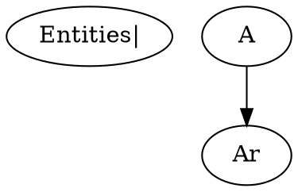
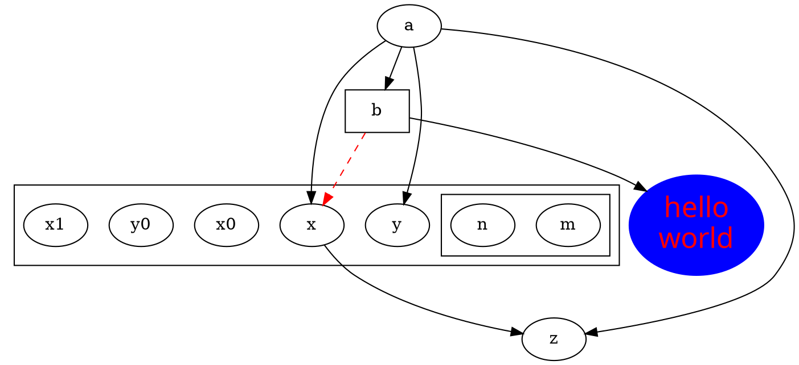
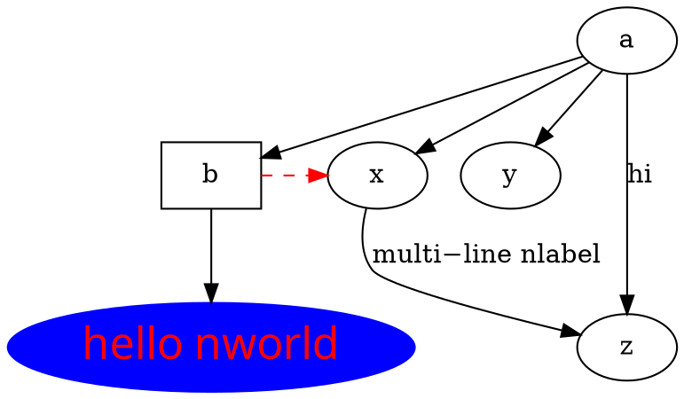
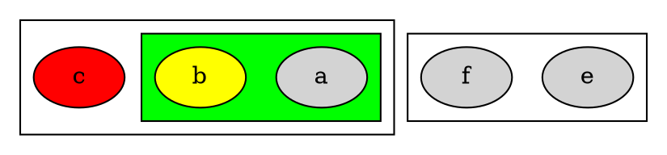
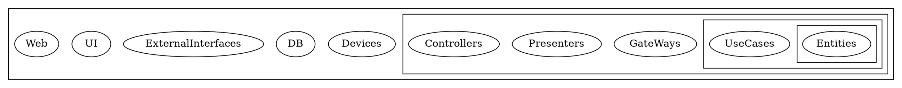
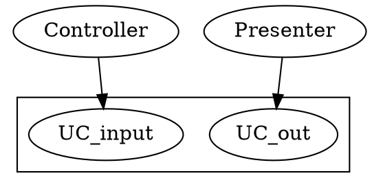
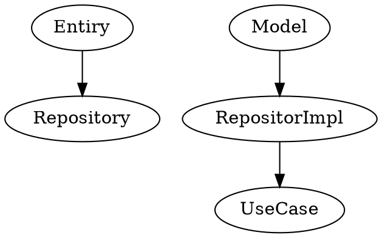
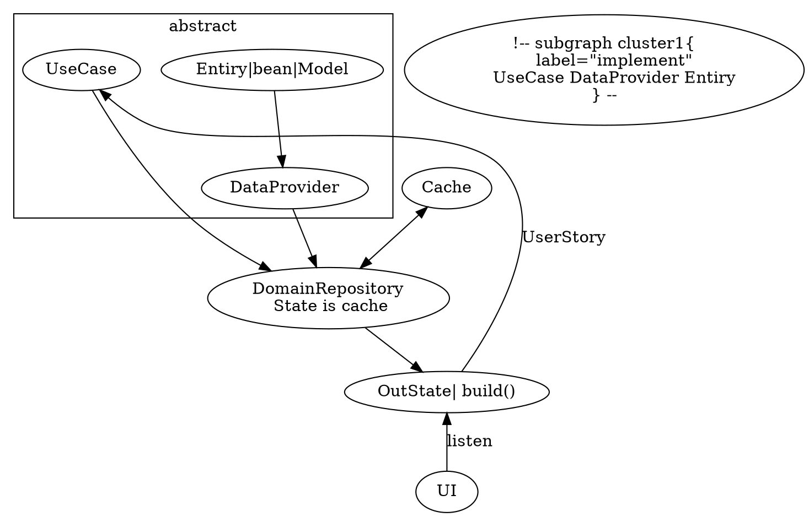

# nature_things

Entities BusinessRules
> Attr

UseCases ApplicationRules
> Event
> UseStory

InterfaceAdapters
> Controller->UC_input---UC_out<-Presenter

case 1

case 2

> UseCase is a Impl, DomainEvent is no need
> all UserStory has runAsync
> model is no need Due to UseCase?
> UserStory and OutState is in business

> P1 build in OutState is ok?
> P2 model is no need Due to UseCase?
> P3 Entiry|bean|Model 不可以with
>   Entiry字段 bean_json 
> P4 where is to place State->OutState 